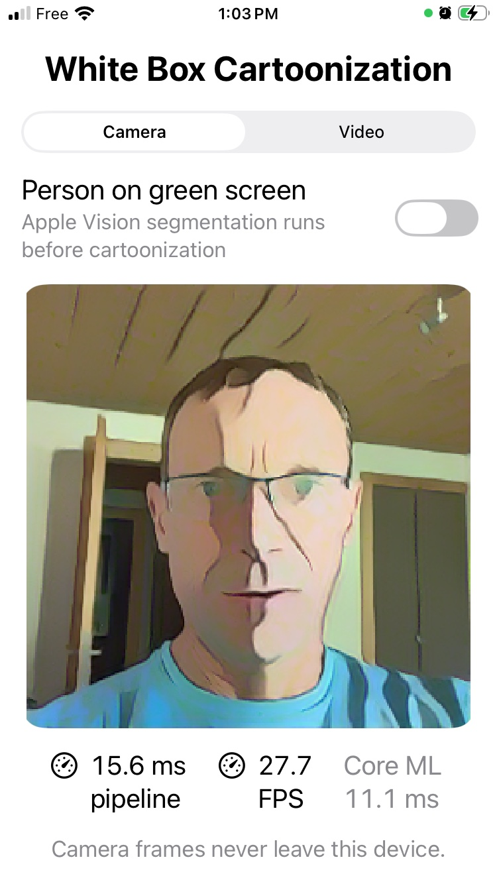
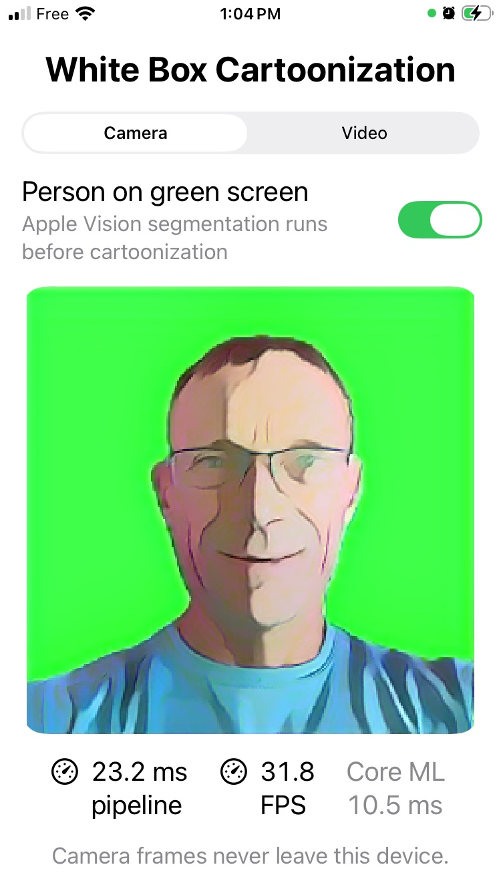

# White Box Cartoonization for Apple devices

A native SwiftUI test bench for the White-box Cartoonization model used by the sibling `animeganv3-browser` project. It runs a live camera or a video from Photos through an FP16 Core ML model, drops frames while inference is busy, and reports model latency plus observed output FPS.

On iPhone and iPad, the cartoon preview uses the full available width in portrait and the full available height in landscape. Controls scroll below the preview in portrait and move into a side panel in landscape, so they never squeeze the live canvas.

Tap the **Video** segment to choose a clip from Photos, or drag a movie from Files or Finder directly onto the preview. The drop target highlights while a compatible movie is over it. Selected videos play muted, loop automatically, and can be replaced by tapping the segment or dropping another movie.

Tap **Choose a song** to open a dedicated search sheet and retrieve up to 10 previewable results from Apple's iTunes Search API. Choosing a result closes the sheet and streams its preview on a loop. The compact now-playing row shows the selected title and artist, provides play/pause and a store link, and does not download or save preview audio.

The optional **Person on green screen** toggle first runs Apple's on-device Vision person-segmentation model, composites the detected person over pure green, and feeds that result to White-box Cartoonization. A translucent overlay on the live preview reports output FPS, total pipeline latency, resolution, and Core ML model latency so the segmentation cost remains visible without taking space from the canvas.

## Examples

| White-box camera | Vision person segmentation + green screen |
| --- | --- |
|  |  |

The single iOS/iPadOS target also runs unmodified on Apple-silicon Macs as a **Designed for iPad** app. This avoids maintaining a separate native macOS target while retaining Finder drag and drop. All frames remain on-device.

## What is included

- `Models/WhiteBoxCartoonization256.mlpackage`: 256 × 256 FP16 ML Program with RGB `CVPixelBuffer` input and output.
- `Models/WhiteBoxCartoonization384.mlpackage`: higher-detail 384 × 384 variant using the same weights.
- `Sources/`: shared camera, Photos video playback, center-crop, Core ML inference, and SwiftUI UI.
- `scripts/convert_coreml.py`: reproducible ONNX → PyTorch → Core ML conversion with ONNX Runtime parity validation.
- `project.yml`: XcodeGen source for the checked-in Xcode project.

The conversion folds the browser pipeline's RGB↔BGR channel swap, `[-1, 1]` normalization, and output denormalization into the model. It also implements ONNX's asymmetric bilinear resize exactly; using PyTorch's default half-pixel resize changes the result substantially. The app's resolution picker loads the matching fixed-shape model, with 256 × 256 as the real-time default and 384 × 384 as the detailed option.

## Run

Open `WhiteBoxCartoonization.xcodeproj`, select `WhiteBoxCartoonization-iOS`, choose an iPhone, iPad, or **My Mac (Designed for iPad)** destination, and Run. Camera access is requested only when the camera source starts. The Video tab uses the system Photos picker; videos can also be dropped onto the preview from Files on iPad or Finder on Mac.

Regenerate the project after changing `project.yml`:

```sh
xcodegen generate
```

## Reconvert the model

Python 3.10 was used because the conversion stack does not yet support every newer Python release.

```sh
/opt/homebrew/bin/python3.10 -m venv .venv
.venv/bin/pip install onnx onnxruntime coremltools torch onnx2torch pillow numpy
.venv/bin/python scripts/convert_coreml.py \
  /Users/ldenoue/Documents/ChatGPT/animeganv3-browser/public/models/WhiteBox_Cartoonization.onnx \
  Models/WhiteBoxCartoonization256.mlpackage
.venv/bin/python scripts/convert_coreml.py \
  /Users/ldenoue/Documents/ChatGPT/animeganv3-browser/public/models/WhiteBox_Cartoonization.onnx \
  Models/WhiteBoxCartoonization384.mlpackage --size 384
```

The converter first checks its PyTorch wrapper against the source ONNX graph. The checked-in conversion had a maximum pre-FP16 difference of `0.000374`. After Core ML FP16 lowering, a deterministic random-image check measured mean absolute pixel error `0.317`, p99 `1.033`, and maximum `3.195` on a 0–255 scale.

## Performance observed locally

On an Apple M4 MacBook Air, 20 warmed direct Core ML predictions at 256 × 256 measured:

- median 22.72 ms (44.0 predictions/s)
- mean 22.82 ms
- p95 23.43 ms

The 384 × 384 variant measured 54.58 ms median (18.3 predictions/s), 54.86 ms mean, and 56.48 ms p95 on the same Mac. It processes 2.25 times as many pixels as the 256 model.

This is model-only throughput from Python. The app's live counters are the useful numbers for a particular Mac or iPhone because they include model scheduling and actual frame cadence. The app uses `.all` compute units so Core ML can choose CPU, GPU, or Neural Engine partitions.

## Existing conversion research

The closest reusable artifact found was john-rocky's `CoreML-Models` model zoo, which lists a 5.9 MB, fixed 1536 × 1536 White-box model. That conversion is useful for high-resolution stills but is a poor live-video default: convolutional work grows roughly with pixel count, and 1536² contains 36 times as many pixels as 256². It is also distributed through an external Google Drive link without a matching conversion script in the listing. This project therefore converts the exact ONNX model already used by the browser app and targets 256 × 256 for measurable real-time performance.

Apple's maintained `coremltools` unified converter accepts TensorFlow and PyTorch, not modern ONNX directly. The old ONNX converter is frozen and supports only old opsets, so this project uses `onnx2torch`, validates its output against ONNX Runtime, then uses Apple's PyTorch converter to produce an ML Program.

## License

The upstream model and project are CC BY-NC-SA 4.0 and prohibit commercial use. See `THIRD_PARTY_NOTICES.md`. The converted weights retain those restrictions; do not ship them commercially without permission from the rights holder.
